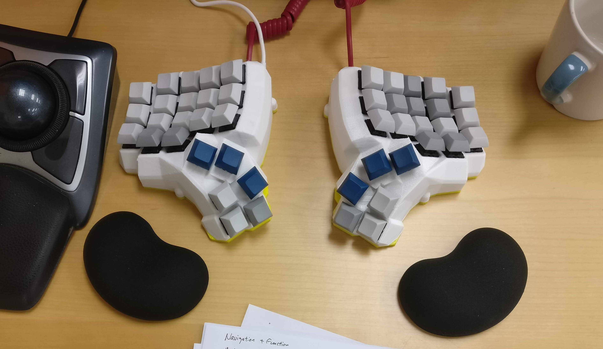
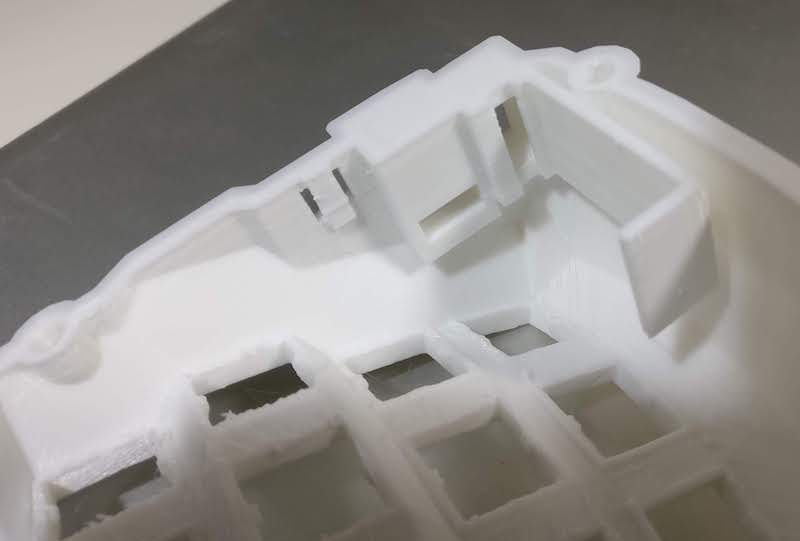
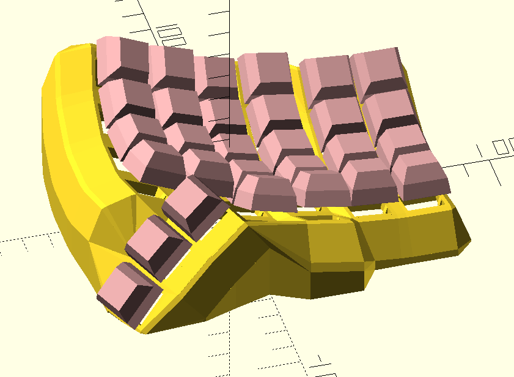
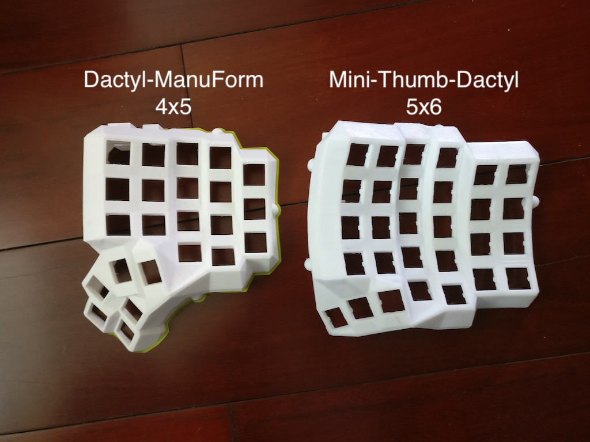

# The Mini Thumb Dactyl Keyboard
This is a fork of the [Dactyl-ManuForm](https://github.com/tshort/dactyl-keyboard), a parameterized, split-hand, concave, columnar, ergonomic keyboard.

The Dactyl-Manuform is a fork of the [Dactyl](https://github.com/adereth/dactyl-keyboard) with the thumb cluster from [ManuForm](https://github.com/jeffgran/ManuForm).

My fork contains below versions of keyboard models:

### Enhanced Dactyl-ManuForm

File: [`dactyl.clj`](src/dactyl_keyboard/dactyl.clj)

It's basically the original Dactyl-ManuForm with some enhancements, including:

- Printable bottom plate
- Add hole to mount reset botton (Some manufactory's Pro Micro requires double reset to flash firmware)
- Replace Teensy holder with Pro Micro holder

### Dactyl-ManuForm, thumb part printed separately (WIP)

File: [`dactyl_split.clj`](src/dactyl_keyboard/dactyl_split.clj)

The model might be larger than printable area of some 3D printers. I tried to separate the thumb part from main body of the keyboard to make it smaller.

It's isn't fully done. Above enhancements aren't added into this version.

### Mini-Thumb-Dactyl (WIP)

File: [`mini_thumb_dactyl.clj`](src/dactyl_keyboard/mini_thumb_dactyl.clj)

I'm comfortable with the concave curve of Dactyl-ManuForm keyboard. But I don't need so many thumb keys. This version reduces thumb keys to three on each hand.

Printable area requirement for mini-thumb-dactyl 5x6 is 16cm x 14cm, or delta printer diameter 18cm.

## Assembly

### Generating a Design

**Setting up the Clojure environment**
* [Install the Clojure runtime](https://clojure.org)
* [Install the Leiningen project manager](http://leiningen.org/)
* [Install OpenSCAD](http://www.openscad.org/)

**Generating the design**
* Run `lein repl`
* Load the file `(load-file "src/dactyl_keyboard/dactyl.clj")` (change file name for other version)
* This will regenerate the `things/*.scad` files
* Use OpenSCAD to open a `.scad` file.
* Make changes to design, repeat `load-file`, OpenSCAD will watch for changes and rerender.
* When done, use OpenSCAD to export STL files

**Tips**
* [Some other ways to evaluate the clojure design file](http://stackoverflow.com/a/28213489)
* [Example designing with clojure](http://adereth.github.io/blog/2014/04/09/3d-printing-with-clojure/)

### Printing
Print the generated models: `left` and `right`. There are also models for bottom plate: `left-plate`, `right-plate`.

Fix the model before printing if it has defects. I use [Netfabb Free](https://github.com/3DprintFIT/netfabb-basic-download) to and it's automatically done.

### Wiring & Firmware

Please read the guide: [How to Make a Dactyl Manuform Keyboard](./guide/index.md)

## License

Copyright © 2015-2017 Matthew Adereth, Tom Short and Leo Liang.

The source code for generating the models (everything excluding the [things/](things/), [guide/](guide/) and [resources/](resources/) directories is distributed under the [GNU AFFERO GENERAL PUBLIC LICENSE Version 3](LICENSE).  The generated models and PCB designs are distributed under the [Creative Commons Attribution-NonCommercial-ShareAlike License Version 3.0](LICENSE-models).
