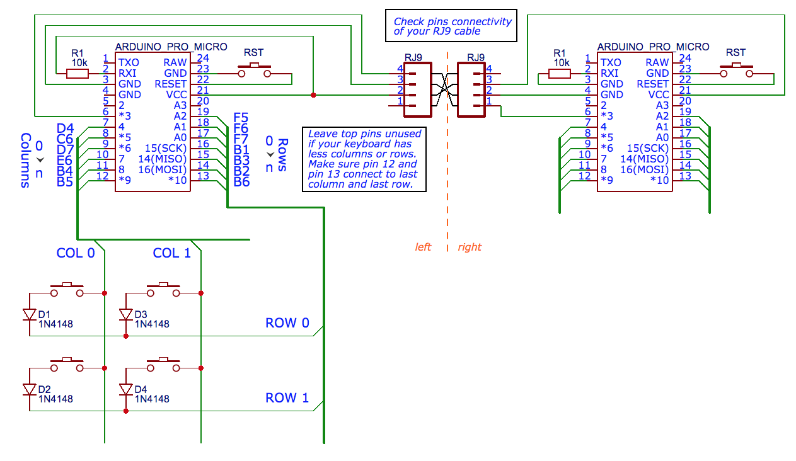
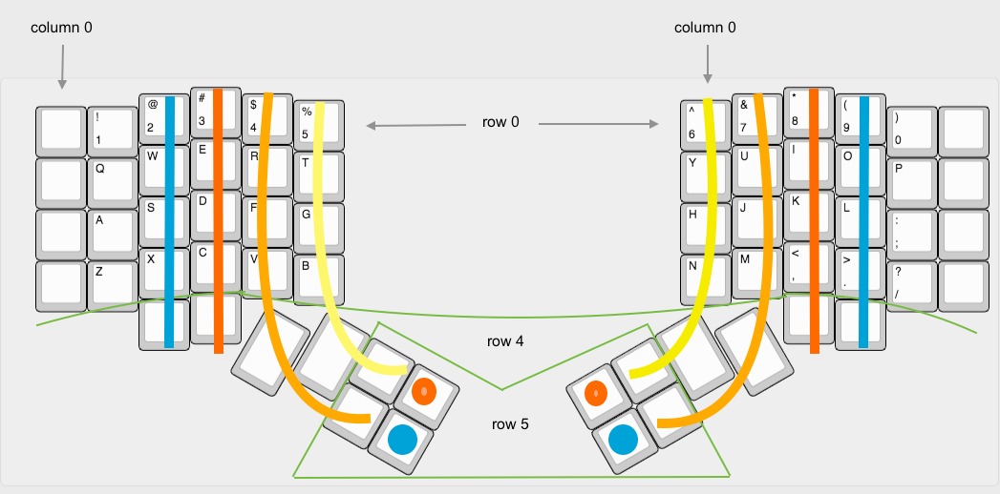
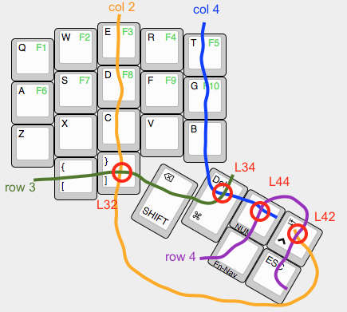
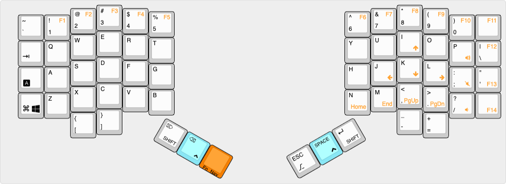
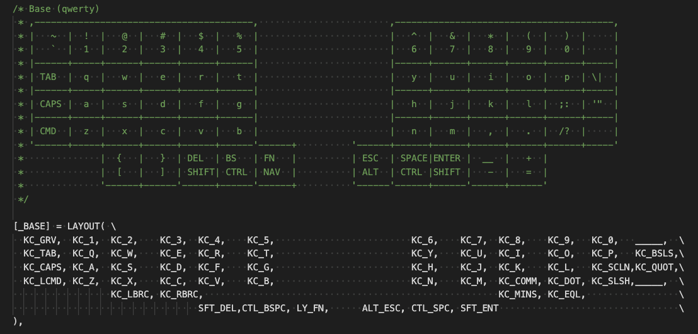

# How to Make a Dactyl Manuform Keyboard

Dactyl Manuform keyboard is a split-hand ergonomic keyboard. It isn't a commerial production so you have to make by yourself. 

This guide gives an overview to beginners who want to make a Dactyl Manuform keyboard. It links to websites with further information.


## Materials

| Material                   | Number       |          | Remark                                                       |
| -------------------------- | ------------ | -------- | ------------------------------------------------------------ |
| Arduino Pro Micro          | 2            |          |                                                              |
| Main body                  | left & right |          | 3D printed                                                   |
| RJ9 cable                  | 1            |          | Telephone handset cable                                      |
| RJ9 connector              | 2            |          | Female connector.                                            |
| Key switch                 | N            |          | Cherry MX                                                    |
| Keycap                     | N            |          | DSA or SA row 3. Four of them are 1.5U, but I use 1U as well. |
| 1N4148 diode               | N            |          |                                                              |
| 10k resistor               | 2            | optional | To tell left/right hand                                      |
| Magnet wire or copper tape |              |          | To wire switches in column.                                  |
| Bottom plate               | left & right | optional | 3D printed                                                   |
| M3 flat head screw, 4~6mm  | 10           | optional | If you need to mount the bottom plate.                       |
| M3 heat set inserts, 4mm   | 10           | optional | If you need to mount the bottom plate.                       |
| Tact switch, 6*6mm         | 2            | optional | Reset button. Some manufactory's Pro Micro requires double reset to flash firmware. |

_N = number of keys_

I couldn't find a merchant on Ali Taobao who sells RJ9 female connector. Finally I got them from an old telephone. You can connect two parts with any cable with at least 3 wires.

## 3D Printing

The origin Dactyl-ManuForm keyboard project is [tshort/dactyl-keyboard](https://github.com/tshort/dactyl-keyboard). There are a lot of forks and some of them contain improvements or changes. You may need to take some time to choose which one is best fit for you.

Here listed some of the forks with changes:

- https://github.com/aleung/dactyl-manuform-keyboard - My fork // TODO: describe what's changed
- https://github.com/FSund/dactyl-manuform-keyboard
- https://github.com/l4u/dactyl-manuform-mini-keyboard

### Generate 3D Model

The model of Dactyl Manuform keyboard main body is written in Clojure programming language. To generate the STL file to send to print, you need below procedure:

```
Clojure source code --[Clojure]--> OpenSCAD source code --[OpenSCAD]--> STL
```

There is guide on the GitHub project about how to do it. But to a non-developer it might be still not easy to set up a Clojure development environment and run the program. You can download pregenerated STL file from [Thingiverse](https://www.thingiverse.com/) (search "manuform") or from `things` folder in GitHub projects, but then you lose the possibility to customise the model.

I found that the STL files generated by OpenSCAD are corrupted. But it can be repaired easily by auto repair function in [Netfabb Basic](https://github.com/3DprintFIT/netfabb-basic-download/releases).

I printed it in PLA with 0.2mm layer height. Each part took about 8 hours to print.

### Split Print

The print .... // TODO

## Circuit Wiring




Note that a telephone handset cable has leads that are reversed, so take this into account when connecting these leads to the controller.

There is a 10k resistor (R1) connects to RXI pin (which is AVR pin D2). On left hand it pulls up to VCC and on right hand it pulls down to GND to tell firmware which hand it is. It's optional: if the RXI pin isn't connected to anything then you can config firmware to determine left/right by whether has USB cable plugged (having USB connection is master). It's described in Firmware Config section below.

There is no standard way to wire the matrix of keys. You can decide how to connect them into rows and columns, as long as you adjust the layout definition accordingly in firmware.

According to QMK firmware convention, rows are numbered from top to bottom and columns are numbered from left to right. 

Below is a solution to wire a 5x6 keyboard. It's compatible with QMK firmware v0.6.156 (which is the latest version at the time I'm writing this).



_Note: the first diagram of 4x5 wiring in tshort's origin project (and in a lot of forks) is not recommended. It requires more complicated layout configuration in QMK firmware because left and right parts don't use the same pinouts._

To wire the columns, you may use magnet wire or copper tape. To wire the row just use the diods legs as wires connecting each one. QMK has a [hand-wiring guide](https://docs.qmk.fm/#/hand_wire) that explains quite well.


## Firmware

The latest [QMK firmware](https://github.com/qmk/qmk_firmware) already has built-in split keyboard support. So right now it's nothing special to setup a Dactyl Manuform in QMK.

There is predefined Dactyl Manuform keyboard in QMK firmware source code, in directory [`keyboards/handwired/dactyl_manuform/`](https://github.com/qmk/qmk_firmware/tree/master/keyboards/handwired/dactyl_manuform), with several models (4x5, 4x6, 5x6...). But rather than directly use it, I strongly suggest you to choose one model as baseline and copy as another folder, for example `mine`, then make your modification. It's because the firmware config is highly depends on how the keys wired and there is no standard way to wire. At the time I'm writing, the different predefined models don't follow the same way of wiring.

What's more, when you have your own copy in another folder, you can safely merge latest QMK firmware to get update in QMK core, without fearing your keyboard config got changed by others' commit.

In below example I assume the folder is `keyboards/handwired/dactyl_manuform/mine` and it's a 4x5 keyboard.

### Config

The first thing you need to define is how the Pro Micro pinouts connect to key matrix. It's set in `mine/config.h`:

```c
#pragma once
#include "config_common.h"
#define PRODUCT         Dactyl-Manuform (4x5)  // The name of the keyboard shown in OS

#define MATRIX_ROWS 10                         // left rows + right rows
#define MATRIX_COLS 5
#define MATRIX_ROW_PINS { F7, B1, B3, B2, B6 } // 5 rows each size
#define MATRIX_COL_PINS { C6, D7, E6, B4, B5 } // 5 columns. 
                        // col_0 connects to pin C6; col_1 connects to pin D7; ...

#define USE_SERIAL

// How to determine left/right hand. Choose one:
#define SPLIT_HAND_PIN D2  // must have 10k resistor connect to RXI pin
// #define MASTER_LEFT
// #define MASTER_RIGHT
```

Note that the pins aren't Pro Micro pins, but AVR microcontroller pins. I've marked the mapping AVR pins beside Pro Micro pins in the circuit diagram above.

By giving `MATRIX_ROW_PINS` and `MATRIX_COL_PINS`, you define the key matrix by rows and columns wiring in cuicuit. 

The next step is to define a mapping to each keys on the keyboard. It's inside `mine/keyboard.h` (you can change `keyboard` to any name, so long as all existences are changed):

```c
#pragma once
#include "quantum.h"

#define LAYOUT( \
    L00, L01, L02, L03, L04,                     R00, R01, R02, R03, R04, \
    L10, L11, L12, L13, L14,                     R10, R11, R12, R13, R14, \
    L20, L21, L22, L23, L24,                     R20, R21, R22, R23, R24, \
         L31, L32,                                         R32, R33,      \
                   L33, L34,                     R30, R31,                \
                           L44, L42,     R42, R40,                        \
                           L43, L41,     R43, R41                         \
	) \
    { \
		{ L00, L01, L02, L03, L04 },   \
		{ L10, L11, L12, L13, L14 },   \
		{ L20, L21, L22, L23, L24 },   \
		{ KC_NO, L31, L32, L33, L34 }, \
		{ KC_NO, L41, L42, L43, L44 }, \
                                       \
		{ R00, R01, R02, R03, R04 },   \
		{ R10, R11, R12, R13, R14 },   \
		{ R20, R21, R22, R23, R24 },   \
		{ R30, R31, R32, R33, KC_NO }, \
		{ R40, R41, R42, R43, KC_NO }  \
    }
```

You need to carefully check and update the `LAYOUT` macro in this file. There are several lines but actually  what you need to change are in two parts: _physical_keyboard_layout_ and _key_matrix_in_circuit_.

```
#define LAYOUT( <physical_keyboard_layout> ) { <key_matrix_in_circuit> }
```

Let's first see the _key_matrix_in_circuit_ section, each line is a row. First rows are left hand part from row 0 to row 4, and last rows are right hand part from row 0 to row 4 as well. The rows and columns connect to the pins defined in `MATRIX_ROW_PINS` and `MATRIX_COL_PINS` in `mine/config.h`. For the key switch wiring on a row and a column, give it a name by the row number and column number. See below picture as example. If there is no key switch connects between a row and a column, mark it with `KC_NO`.

In _physical_keyboard_layout_ section you put the keys into a shape which is similar to the keyboard physical layout. The spaces and new lines are just for human being to easily read. They mean nothing to the compiler. Actually they're just a list of identifiers.



It's easy to make mistake on the thumb keys. Double check them.

For the simpliest case there is nothing need to be configured inside `mine/keyboard.c`:

```c
#include "keyboard.h"   // remember to change here if you've renamed 'keyboard'

void matrix_init_kb(void) {
	matrix_init_user();
};
```

Now you're done the configurations which is related to how your keyboard is made. 

### Keymap

The keymap defines when a key or keys combination is pressed, what keycode is sent to computer.

QMK firmware has rich features for keymaps. You should read its document beginning from this one: https://docs.qmk.fm/#/keymap

I use the default keymap of my keyboard as example. The code can be found on [GitHub](https://github.com/aleung/qmk_firmware/tree/my_dactyl_manuform/keyboards/handwired/dactyl_manuform/mine/keymaps/default). It's in three layers: base layer for alphabets, a function keys and navigation keys layer and a numbers and punctuation layer. This picture shows partial of the keymaps:



Below is the base layer config of my keyboard. The `LAYOUT` macro defined in `mine/keyboard.h` is used here to assign keycode to each key. It's reasonable to format it alike real keyboard -- intuitive to view. For the key which has no keycode assigned, which mean it's unused, set a placeholder `____` inside.




### Compile

The easy way to compile the firmware is using docker. It saves the time to setup the build environment.

Run below command under the root directory of `qmk-firmware` project:

```sh
docker run -e keyboard=handwired/dactyl_manuform/mine -e keymap=default --rm -v $('pwd'):/qmk:rw acette/qmk_firmware
```

Of cause, you have to already have Docker installed in your system.

If everything works fine, a `.hex` file is generated.

### Flashing

Last step is to use [QMK Toolbox](https://github.com/qmk/qmk_toolbox) to flash the firmware into the keyboard.

Connect the keyboard to computer with USB cable and wait for a few seconds. Open QMK Toolbox, select the hex file to be flashed. When everything is ready, double click the reset button on keyboard and the Pro Micro will go into bootloader mode for 8 seconds. You must start flashing within this period. 

The left hand part and right hand part both need to be flashed.

All done!